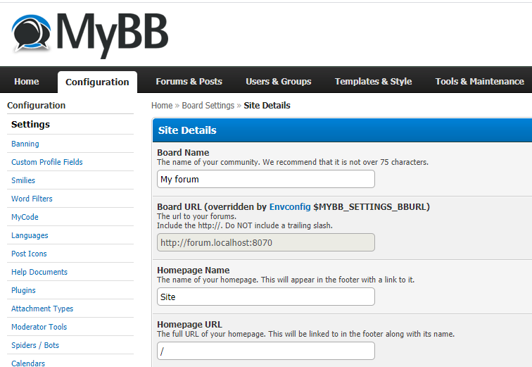

# mybb-envconfig
Envconfig is a plugin for MyBB to overwrite settings using environment variables.
This is especially useful when you want to run a copy of your forum installation in different environments (think production vs local development).

# Usage

* Enable the plugin in the ACP
* Figure out the name of the setting you want to overwrite (you can find them in the database or in `inc/settings.php`)
* Set environment variables for your PHP processes (naming scheme: `MYBB_SETTINGS_<all caps setting name>`)

# Example

I want to do development on a site and I need to regularly import dumps from my production site. Since most of the forum settings are stored in the database, 
importing a dump will overwrite all settings that I may have changed to make things run locally. Changing the `inc/settings.php` file will work most of the
time, but that file will be regenerated in various situations. So I would like to be able to change settings in my local environment while still running
a straight copy of my production site.  

So to make things easier, I'm using docker-compose to run MyBB using a php-fpm image. To make the site work locally there are two key settings that need to
be changed: `bburl` (used to generate URLs on the site) and `cookiedomain` (used for the session cookies, e.g. when logging in). So I set two environment
variables (using the naming scheme shown earlier) named `MYBB_SETTINGS_BBURL` and `MYBB_SETTINGS_COOKIEDOMAIN`.

```yaml
version: '3'
services:
  forum7:
    image: php:7-fpm
    volumes:
      - ./mybb:/var/www/html
    environment:
      - MYBB_SETTINGS_BBURL=http://forum.localhost:8080
      - MYBB_SETTINGS_COOKIEDOMAIN=.forum.localhost
```

The plugin will attempt to make it obvious to admins which settings were overridden. See the screenshot below:  
